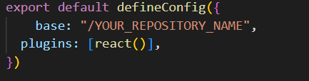
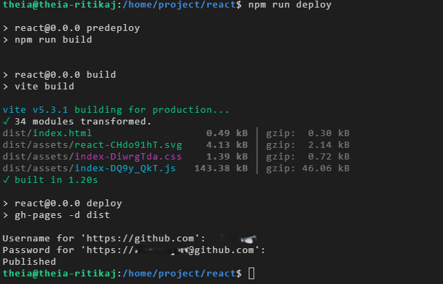

# Paradise Nursery Shopping Application

repository name: `https://github.com/linhnguyen15492/e-plantShopping`

## Deploying Your Application with GitHub Pages

To deploy your react application in GitHub you need to install gh-pages. This allows you to use it as a tool for deploying your project to GitHub Pages. Perform given command in the terminal

```bash
npm install gh-pages --save-dev
```

Add given lines before "build": "vite build" in package.json file.

```json
"predeploy": "npm run build",
"deploy": "gh-pages -d dist",
```

Then in the vite.config.js file add this line before plugins: [react()]

```js
base: "/YOUR_REPOSITORY_NAME",
```



Now perform deploy command in the terminal to executes the "deploy" script defined in the package.json file, deploying the project to GitHub Pages using the gh-pages tool.

```bash
npm run deploy
```


